# Terrava — Enterprise Wealth Intelligence Platform

> Production-grade multi-tenant SaaS on AWS | AI-powered investment analysis across 11 global markets

[](https://aws.amazon.com)
[](https://aws.amazon.com/lambda/)
[](https://aws.amazon.com/bedrock/)
[](.)
[](.)

---

## What is Terrava?

A production SaaS platform with two products: (1) an AI-powered investment intelligence platform for global real estate investors, and (2) an AI Agent CRM that helps real estate agents manage clients, automate follow-ups, and close deals using AI that writes in their voice.

Not a tutorial. Not a demo. A deployed SaaS product with real property data, AI-powered analysis, a Chrome Extension on 40+ listing sites, an agent CRM with AI voice profiles, subscription billing, and enterprise-grade AWS infrastructure.

**9,879 live property listings** · **11 global markets** · **13 investment calculators** · **AI wealth advisor** · **Chrome Extension (40+ sites)** · **AI Agent CRM** · **8 subscription tiers**

**This repository contains the architecture documentation, screenshots, and design decisions.** Production codebase is private.

---

## The Product

| Homepage | Properties | Property Detail |
|:---:|:---:|:---:|
|  |  |  |

| Investment Calculator | Pricing & Billing |
|:---:|:---:|
|  |  |

| Community Hub | Neighborhoods Guide | Golden Visa Calculator |
|:---:|:---:|:---:|
|  |  |  |

---

## Investment Calculator Suite — 13 Specialized Tools

13 calculators rebuilt with premium UX, AI-powered deal scoring, and real fee accuracy across multiple markets.

| ROI Calculator — Deal Score & KPI Cards | Property Analysis Chain |
|:---:|:---:|
|  |  |
| *Deal Score engine rates every property 1-10. KPI cards show ROI, net yield, breakeven at a glance.* | *Property → ROI → Mortgage → Total Cost analysis chain. Click "Analyze" on any listing and data pre-fills across all calculators.* |

**Key features:**
- **Deal Score Engine** — AI-powered 1-10 rating with color-coded gauge
- **Cash/Mortgage Toggle** — defaults adapt per market (cash common in UAE, mortgage in US/UK)
- **Advanced Fee Inputs** — market-specific transaction costs for 97%+ accuracy
- **Dual Currency** — purchase price shown in local currency + your home currency
- **Area Presets** — one-click to load local market benchmark data
- **Property Chain** — analyze any listing → ROI → Mortgage → Total Cost, all pre-filled

**13 calculators:** ROI · Mortgage · Total Cost · Airbnb Yield · Rent vs Buy · STR vs LTR · Off-Plan · Cap Rate · DSCR · Commercial Lease · Free Zone · Scenario Comparison · Golden Visa

---

## Community Platform

A real-time investor community with trending market intelligence, structured deal sharing, and social features.

| Community Feed — Trending Ticker & Deal Cards | Saved Strategies Library |
|:---:|:---:|
|  |  |
| *Trending ticker shows area mentions + sentiment. Deal cards let users share properties with one-click ROI analysis.* | *Auto-saved AI conversations with star, tag, and search. Continue any strategy from where you left off.* |

**Features:** Trending ticker · Structured deal cards · Follow + quote repost · Area tags with sentiment · Who to follow · Saved strategies with star/tag (Pro+)

---

## Chrome Extension — 40+ Property Sites Worldwide

The Chrome Extension works on property listing sites across 11 markets, providing instant AI-powered investment analysis right where investors are already browsing.

**Supported sites include:** Zillow, Redfin, Realtor.com, Trulia (US) · Bayut, PropertyFinder, Dubizzle (UAE) · Rightmove, Zoopla, OnTheMarket (UK) · Domain, RealEstate.com.au (AU) · PropertyGuru, 99.co (SG) · Idealista (ES/PT/IT) · and 15+ more across Canada, Turkey, Japan, Thailand, Germany, Netherlands, France

**How it works:**
1. Browse any supported listing site — Extension detects the listing automatically
2. Overlay badge shows instant price comparison vs market average (no login needed)
3. Click for full AI analysis — yield, cap rate, mortgage estimate, deal score
4. Market-specific calculations per currency (different mortgage terms, tax rules, expense ratios per country)
5. Save properties to your Terrava dashboard for portfolio tracking

**Extension tiers:** Free (view-only, 3 preview analyses) · Investor (full analysis, 3/day) · Pro (unlimited) · Portfolio (unlimited + team sharing)

---

## Pricing — Investor & Agent Tiers

| Investor Pricing (4 Tiers) | Agent Pricing (4 Tiers) |
|:---:|:---:|
| 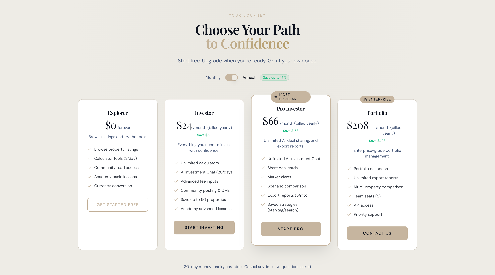 | 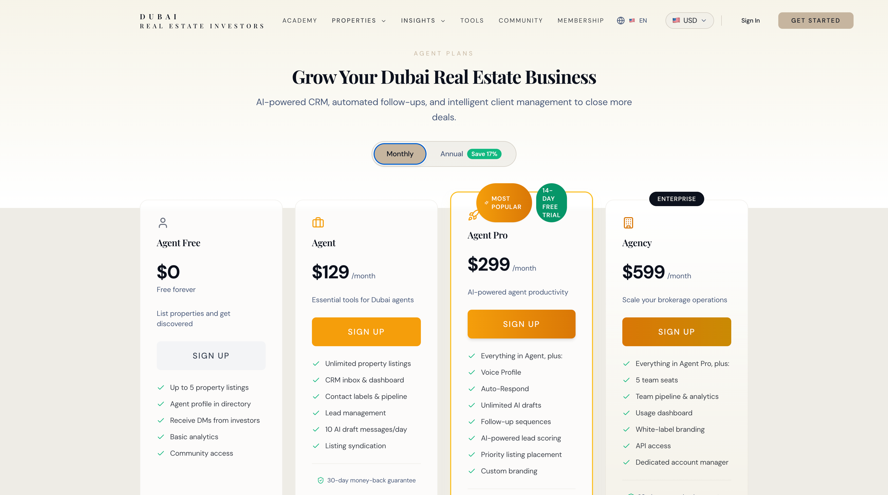 |
| *Explorer (Free) → Investor ($29) → Pro ($79) → Portfolio ($249)* | *Agent Free → Agent ($129) → Agent Pro ($299) → Agency ($599)* |

All tiers include Chrome Extension access with progressive feature unlocks.

---

## AI Agent CRM

A complete AI-powered CRM for real estate agents. The AI learns each agent's communication style and handles 80% of client messaging automatically.

| Agent Dashboard — Command Center | Agent Messages — 3-Panel CRM Inbox |
|:---:|:---:|
|  |  |
| *Glassmorphic dashboard with pipeline stats, client activity feed, smart alerts, tasks, and quick actions* | *Left: conversation list with contact labels + unread badges. Center: chat with AI draft button. Right: CRM panel with pipeline, notes, tasks.* |

| Voice Profile — AI Writes in Your Voice | Agent Pipeline — Deal Stages |
|:---:|:---:|
|  |  |
| *4-step wizard: choose communication style → signature traits → paste example messages → preview AI-generated message in your voice* | *Lead → Property Search → Viewing → Offer → Negotiation → Closing — with deal values and contact labels* |

**AI Agent CRM features:**
- **AI Voice Profile** — agents train the AI to write in their style (greeting, sign-off, emoji usage, formality level, example messages)
- **AI Draft Replies** — AI generates contextual replies using the agent's voice + sales psychology
- **AI Auto-Respond** — when agent is offline, AI responds to clients automatically (configurable)
- **Contact Labels** — Prospect, Client, VIP, Past Client, Cold — each with different AI follow-up cadences
- **Follow-up Sequences** — automated multi-step sequences with sales principles per step
- **Smart Notifications** — behavioral triggers based on client activity
- **Pipeline Management** — visual deal stages with values and conversion tracking
- **Future-ready for WhatsApp + SMS** — unified inbox architecture

---

## Investment Analysis Engine

The original analysis pipeline — browse a listing → calculate returns → get AI analysis → download PDF.

| Analyze Investment Button | Custom Expense Builder |
|:---:|:---:|
| 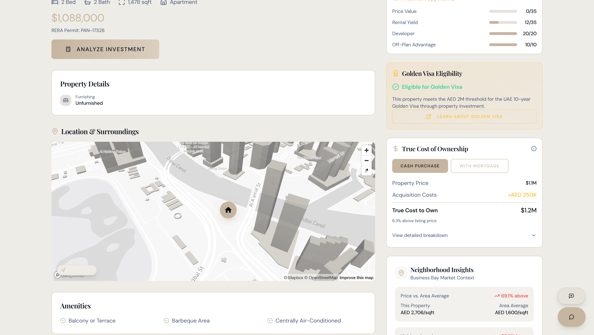 | 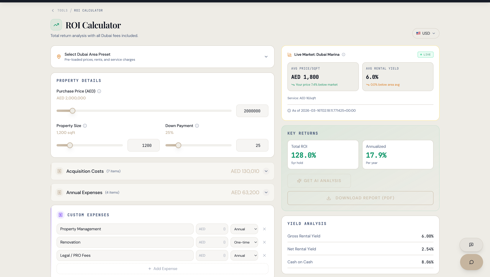 |

| Monthly Cash Flow Projection | AI Deal Score & Risk Analysis |
|:---:|:---:|
| 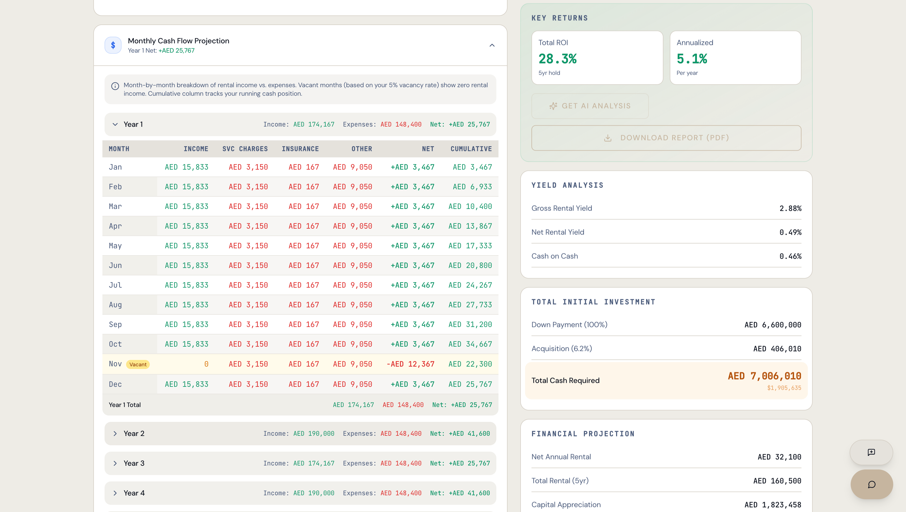 | 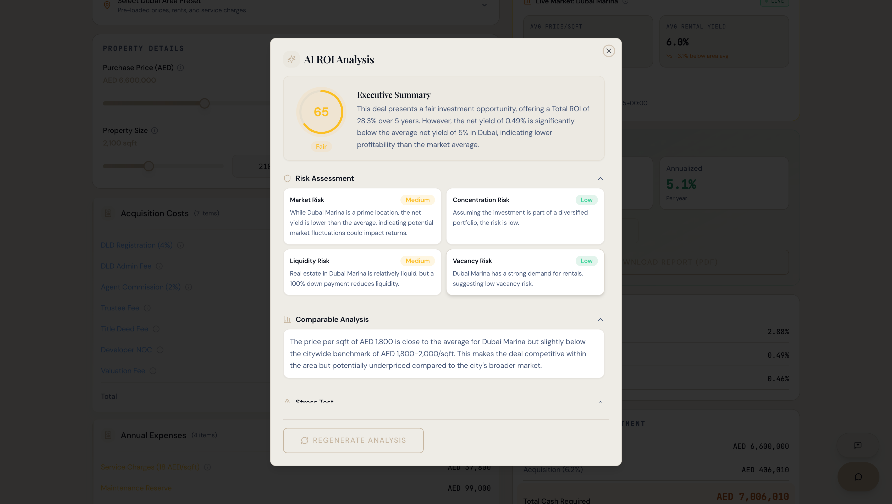 |

| Scenario Comparison | PDF Export |
|:---:|:---:|
| 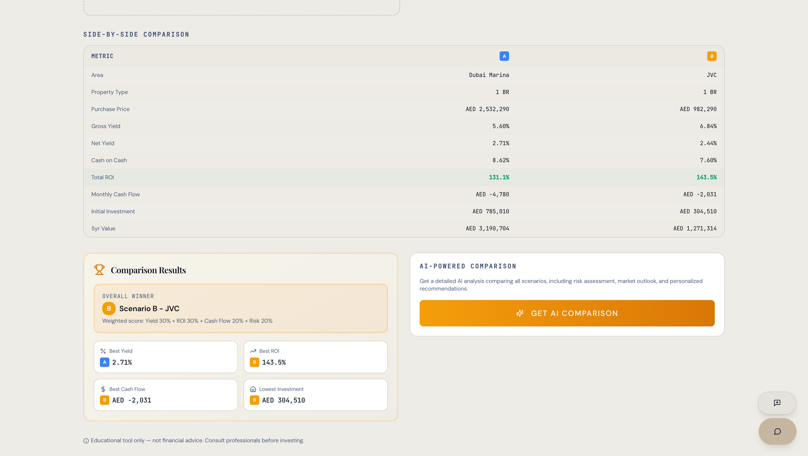 | 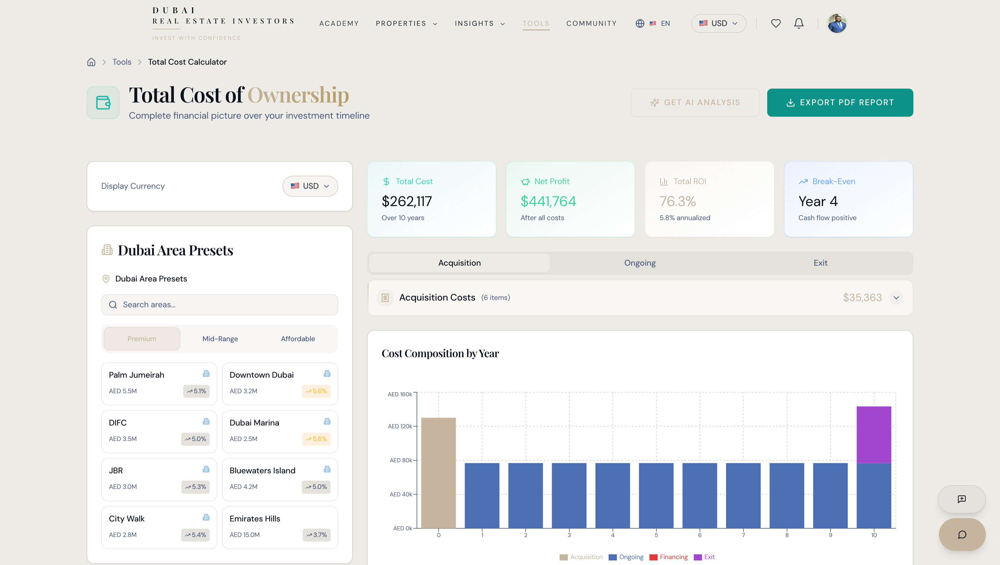 |

---

## Architecture Overview

Every component deployed via AWS CDK (TypeScript). Zero console clicks. Full infrastructure-as-code.

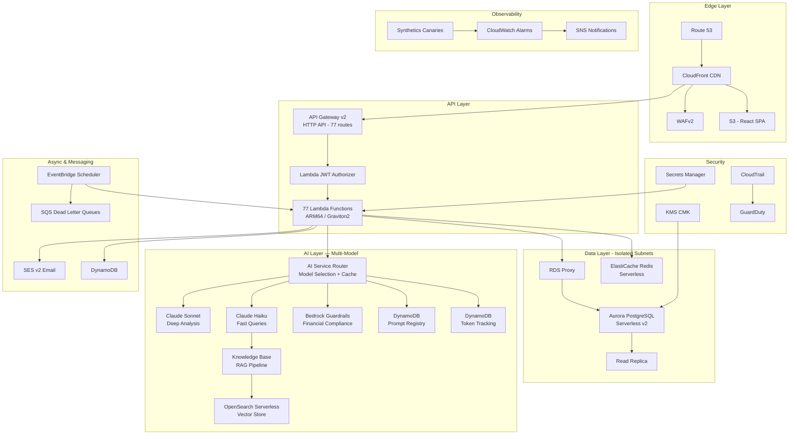

### VPC — 3-Tier Network Isolation

```
+------------------------------------------------------------------+
|  VPC (10.0.0.0/16) — 3 Availability Zones                       |
|                                                                    |
|  Public Subnets     — NAT Gateways, load balancers               |
|  Private Subnets    — Lambda functions (internet via NAT only)    |
|  Isolated Subnets   — Aurora + Redis (NO internet access at all)  |
+------------------------------------------------------------------+
```


---

## AWS Console — Deployed Infrastructure

### All CDK Stacks


*Every stack in `CREATE_COMPLETE`*

### Database — Aurora Serverless v2 + RDS Proxy

| Aurora Cluster (Writer + Reader) | RDS Proxy Configuration |
|:---:|:---:|
|  |  |

- Aurora PostgreSQL Serverless v2 auto-scales 0.5–16 ACU
- RDS Proxy multiplexes 1,000 Lambda connections → 20–50 real DB connections
- Read replica in separate AZ for failover

### Caching — ElastiCache Redis Serverless


- Redis 7.1 Serverless — auto-scales with demand
- API response caching + sliding-window rate limiting

### AI — Multi-Model Bedrock Architecture with RAG

The platform runs a **multi-model AI architecture** that intelligently routes each request to the optimal model — reducing costs by 60% while improving response quality.

| AI Investment Advisor (Bedrock) | Bedrock Knowledge Base (RAG) |
|:---:|:---:|
|  |  |
| *AI analyzing investment — area comparison, fee breakdown, projected yields* | *Knowledge Base with regulatory documents and market reports — returns answers with sourced citations* |

| Bedrock Guardrails | CloudWatch AI Metrics |
|:---:|:---:|
|  |  |
| *Financial compliance filtering — blocks guaranteed returns, anonymizes PII, prevents prompt injection* | *Custom CloudWatch namespace tracking tokens, cost per model, latency, and cache hit rate* |

**How the AI Router works:**
- **Pro/Portfolio users** → Claude Sonnet — deep portfolio analysis, multi-step reasoning
- **Investor/Free users** → Claude Haiku — fast, accurate investment Q&A
- **Agent CRM drafts** → Claude Haiku with agent voice profile — personalized client communication
- **Fallback chain** → If primary model fails, auto-routes to next model with circuit breaker
- **Response cache** → DynamoDB with 24hr TTL, 40-60% hit rate, saves repeat model calls
- **Prompt registry** → Versioned prompts in DynamoDB with A/B testing framework

| DynamoDB Prompt Registry | Token Usage Tracking |
|:---:|:---:|
|  |  |
| *Versioned prompts — change AI behavior without deploying code* | *Every AI call tracked: model, tokens, cost, latency — per user, per function* |

| DynamoDB AI Tables | OpenSearch Vector Store |
|:---:|:---:|
|  |  |
| *Three tables: prompt registry, token tracking, response cache* | *OpenSearch Serverless collection powering the RAG vector store* |

**RAG Pipeline**: User asks a regulatory question → Titan Embeddings v2 vectorizes the query → OpenSearch Serverless finds the 5 most relevant document chunks → Claude generates a grounded answer with citations from the source documents.

### Agent Portal

| Agent Dashboard | Agent Pipeline (CRM) |
|:---:|:---:|
| 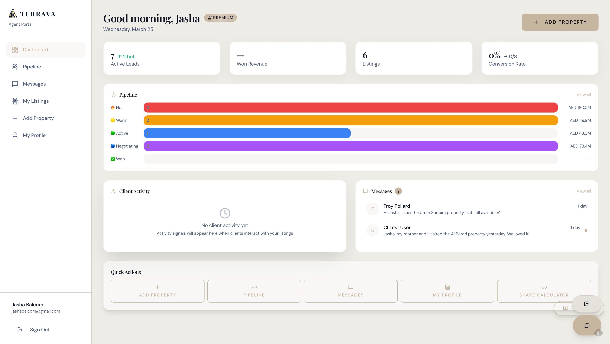 | 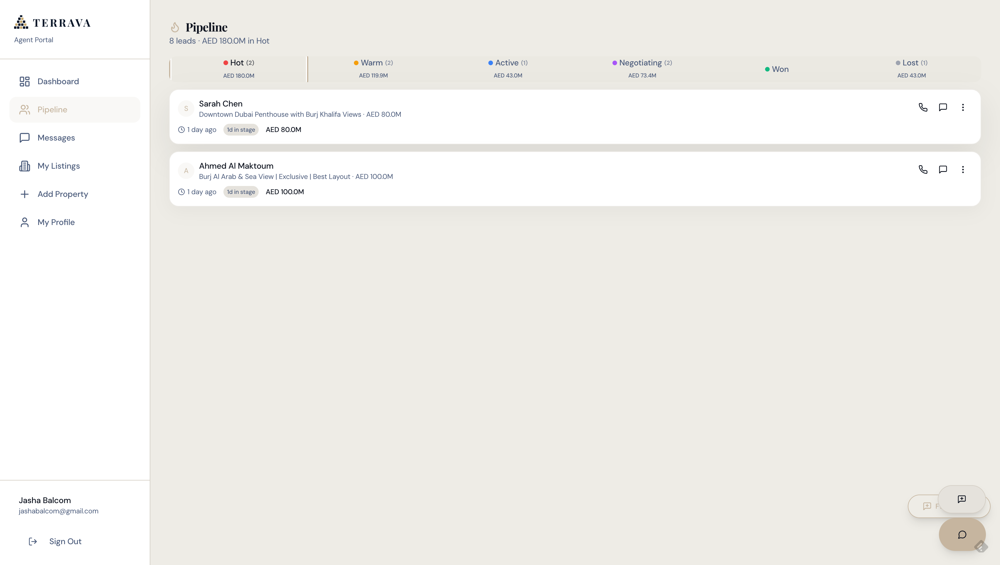 |
| *Real-time stats, pipeline funnel with deal values, client activity feed, recent messages* | *Lead management with stage tracking — deal values and conversion rates* |

| Agent Messages | Shareable Calculator |
|:---:|:---:|
| 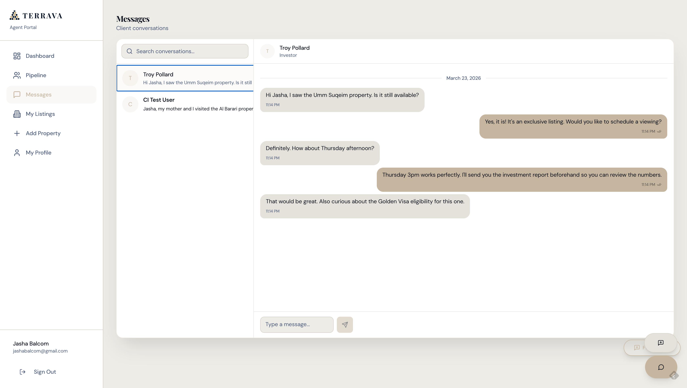 | 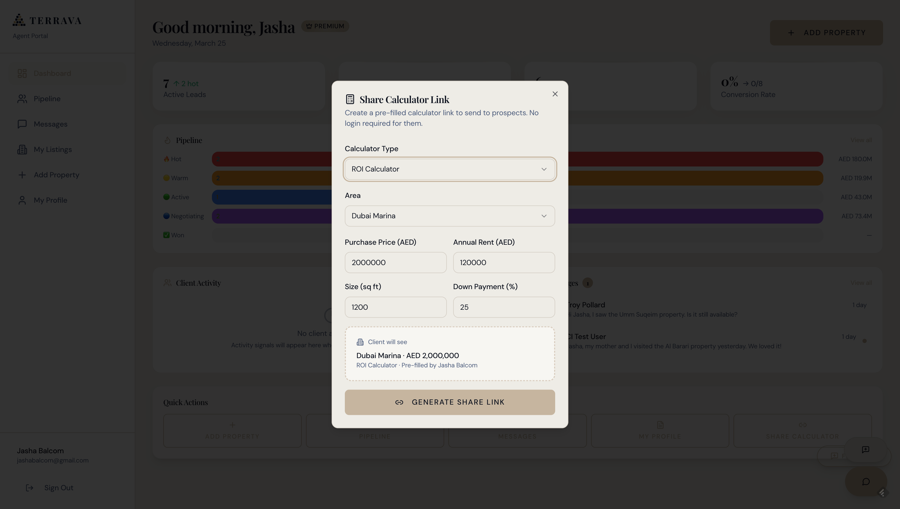 |
| *Split-pane chat with read receipts, conversation search, mobile-responsive* | *Agent generates a branded calculator link — client opens it without an account, agent tracks engagement* |

### Compute — 77 Lambda Functions on ARM64


*77 Lambda functions — all ARM64/Graviton2, Node.js 20*

### API — Gateway HTTP v2


- HTTP API v2 — 71% cheaper than REST API ($1/M vs $3.50/M requests)
- JWT authorizer validates tokens at the edge
- Built-in throttling + per-route configuration

### Monitoring — Synthetics Canaries


*Canaries running every 5 minutes — API health + frontend heartbeat*

### Security — IAM + Secrets Manager + WAF

| IAM Roles (Least Privilege) | Secrets Manager |
|:---:|:---:|
|  |  |

| WAF Rules | IAM Lambda Permissions |
|:---:|:---:|
|  |  |
| *Rate limiting, SQL injection prevention, XSS scanning, IP reputation* | *Resource-level Bedrock, DynamoDB, SSM, and CloudWatch permissions* |

### Auth — Cognito User Pool


### Async — EventBridge + SQS Dead Letter Queues


*Scheduled jobs with DLQ failover for guaranteed processing*

### Cost — Real AWS Spend


---

## 14 CDK Stacks

Every stack is TypeScript CDK. Dependency order managed automatically.

| # | Stack | AWS Services | Purpose |
|---|-------|-------------|---------|
| 1 | **IamStack** | IAM, OIDC Provider | CI/CD with zero stored credentials |
| 2 | **SecurityStack** | KMS, CloudTrail, GuardDuty | Encryption keys, audit trail, threat detection |
| 3 | **DomainStack** | Route 53, ACM | Custom domain + TLS certificates |
| 4 | **EmailStack** | SES v2, DKIM | Transactional email with domain verification |
| 5 | **FrontendStack** | S3, CloudFront, WAFv2 | React SPA hosting with CDN + DDoS protection |
| 6 | **VpcStack** | VPC, Subnets, NAT, Endpoints | 3-tier network (public/private/isolated) x 3 AZs |
| 7 | **DatabaseStack** | Aurora Serverless v2, RDS Proxy | PostgreSQL with auto-scaling + connection pooling |
| 8 | **CacheStack** | ElastiCache Redis Serverless | API response caching + rate limiting |
| 9 | **ApiStack** | API Gateway v2, 77 Lambdas | HTTP API + ARM64 functions + JWT authorizer |
| 10 | **MessagingStack** | EventBridge, SQS DLQs | Async job scheduling with failure capture |
| 11 | **CognitoStack** | Cognito User Pool | Multi-tenant auth with MFA |
| 12 | **ObservabilityStack** | CloudWatch, Budgets, SNS | Alarms, dashboards, cost anomaly detection |
| 13 | **BedrockKBStack** | Bedrock KB, OpenSearch Serverless | RAG pipeline over regulatory docs |
| 14 | **SyntheticsStack** | CloudWatch Synthetics | Canary uptime monitoring |
| 15 | **DynamoDBStack** | DynamoDB | High-throughput event and session storage |
| 16 | **AIInfraStack** | DynamoDB (x3), IAM, SSM | AI prompt registry, token tracking, response cache |

---

## 77 Lambda Functions

| Group | Count | What They Do |
|-------|-------|-------------|
| **AI & Analysis** | 7 | Property analysis, calculator insights, support agent, daily digest, regulatory KB query |
| **Properties** | 3 | Market data sync, scheduled sync, connection testing |
| **Email** | 8 | Welcome flow, drip campaigns, trial-ending, payment-failed, weekly digest |
| **Stripe Billing** | 6 | Checkout, webhooks, subscriptions, customer portal |
| **Admin** | 3 | Revenue stats, snapshot metrics, alert handler |
| **Neighborhoods** | 4 | Geocoding, batch-geocode, POI fetching |
| **News** | 3 | RSS sync, article processing |
| **Affiliate** | 2 | Commission tracking, referrals |
| **Data/Auth/Core** | 41 | CRUD, JWT authorizer, health checks, migrations |

---

## Chrome Extension Architecture

```
+--------------------------------------------------+
|  Chrome Extension (Manifest V3)                   |
|                                                    |
|  Content Script (injected into 40+ listing sites) |
|  - Detect listing page (URL pattern match)        |
|  - Extract price, size, location from DOM         |
|  - Calculate quick score (no API, instant, free)  |
|  - Inject overlay badge on listing                |
|                                                    |
|  Popup (detailed analysis view)                   |
|  - Send page text to API Gateway → Bedrock        |
|  - Display: yield, cap rate, mortgage, score      |
|  - Market-specific calculations per currency      |
|                                                    |
|  Shared Config (market-defaults.js)               |
|  - 11 markets with per-market:                    |
|    mortgage terms, rent ratios, expense ratios,   |
|    vacancy rates, price/sqft benchmarks           |
|  - Adding a new country = 1 config entry          |
+--------------------------------------------------+
```

---

## Security Architecture

| Layer | Implementation |
|-------|---------------|
| **Network** | 3-tier VPC across 3 AZs. Database + cache in isolated subnets — no internet route. |
| **Edge** | WAFv2 with rate limiting, SQL injection, XSS rules on CloudFront + API Gateway. |
| **Auth** | JWT authorizer + Cognito User Pool with MFA. |
| **Encryption** | KMS customer-managed key for data at rest. TLS 1.2+ in transit. ACM auto-renewed. |
| **Secrets** | All credentials in AWS Secrets Manager. Zero hardcoded secrets in code. |
| **Audit** | CloudTrail logs every API call. GuardDuty analyzes CloudTrail + VPC Flow Logs + DNS. |
| **Monitoring** | Synthetics canaries every 5 min. CloudWatch alarms → SNS → email. |
| **CI/CD** | GitHub Actions OIDC federation. No static AWS credentials stored anywhere. |

---

## Cost Engineering

| Decision | Savings | How |
|----------|---------|-----|
| HTTP API v2 (vs REST API) | **71%** | $1/M requests vs $3.50/M |
| Lambda ARM64 Graviton2 | **20%** | Same performance, cheaper processors |
| Aurora Serverless v2 | **60%** | Pay per ACU-second, not provisioned capacity |
| ElastiCache Serverless | **40%** | Auto-scales vs fixed cluster size |
| Multi-model AI routing | **60%** | Use Haiku for fast queries, Sonnet only for deep analysis |
| Response caching | **40-60%** | DynamoDB cache with 24hr TTL reduces repeat Bedrock calls |

---

## Tech Stack

| Layer | Technology |
|-------|-----------|
| **Frontend** | React 18, TypeScript, Tailwind CSS, Vite, Framer Motion, Recharts, Mapbox GL, shadcn/ui |
| **API** | API Gateway HTTP v2, Lambda (Node.js 20, ARM64/Graviton2), Lambda Layers |
| **Database** | Aurora PostgreSQL Serverless v2, DynamoDB, ElastiCache Redis |
| **AI/ML** | Amazon Bedrock (Claude Sonnet/Haiku), Knowledge Bases, Guardrails, Titan Embeddings v2, OpenSearch Serverless |
| **Extension** | Chrome Manifest V3, vanilla JS, 40+ supported sites, 11-market calculation engine |
| **Auth** | Cognito User Pool with MFA |
| **Payments** | Stripe (Checkout, Webhooks, Customer Portal, 8 tiers) |
| **Email** | Amazon SES v2 with DKIM |
| **IaC** | AWS CDK (TypeScript, 14 stacks) |
| **CI/CD** | GitHub Actions with OIDC federation |
| **Monitoring** | CloudWatch Synthetics, X-Ray, Alarms, Budgets |
| **Security** | WAFv2, KMS, Secrets Manager, CloudTrail, GuardDuty |

---

## About

**Jasha Balcom** — AWS Solutions Architect · Global Real Estate Advisor

[](https://linkedin.com/in/jashabalcom)
[](mailto:jashabalcom@gmail.com)

**Sotheby's International Realty** (Global Real Estate Advisor) · **Merrill Lynch** (Financial Services) · Former MLB Draft Pick (Chicago Cubs)

---

*Architecture documentation for Terrava. Production codebase is private.*

Copyright (c) 2025-2026 Jasha Balcom. All rights reserved.
