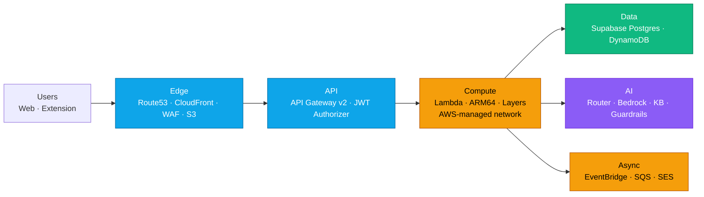
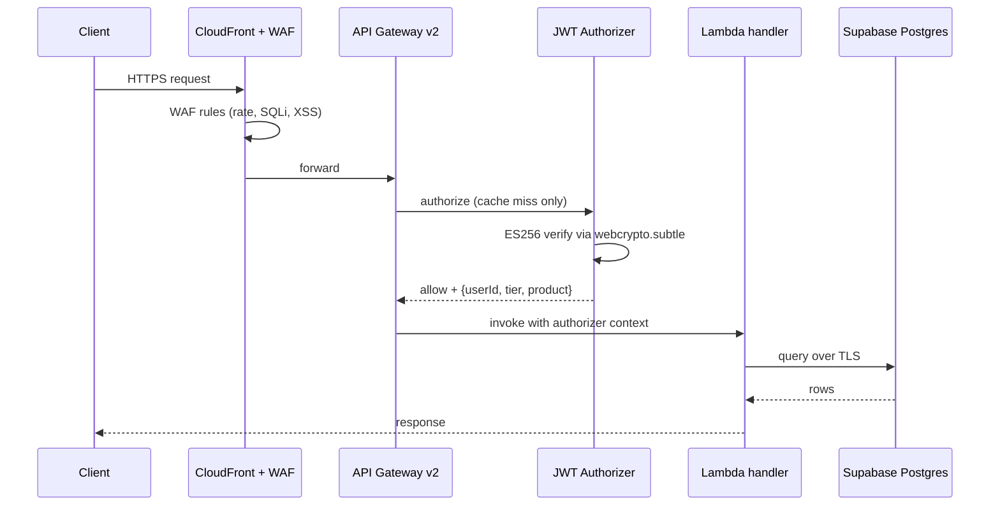
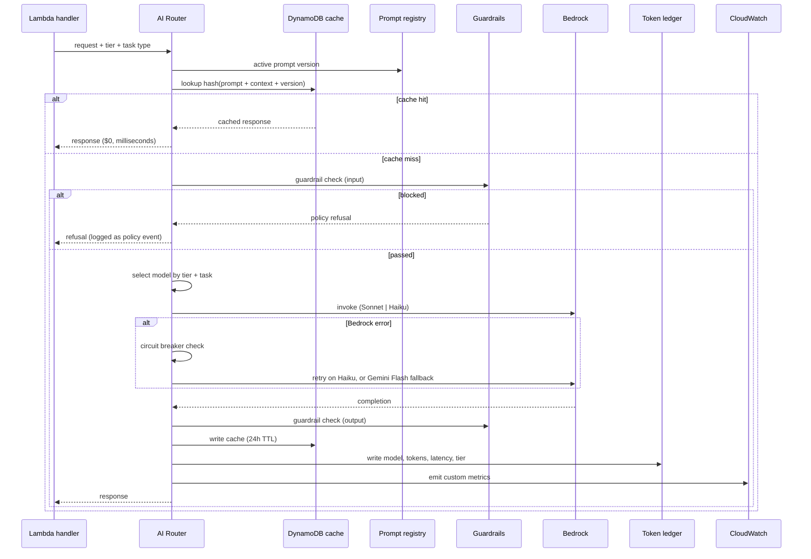
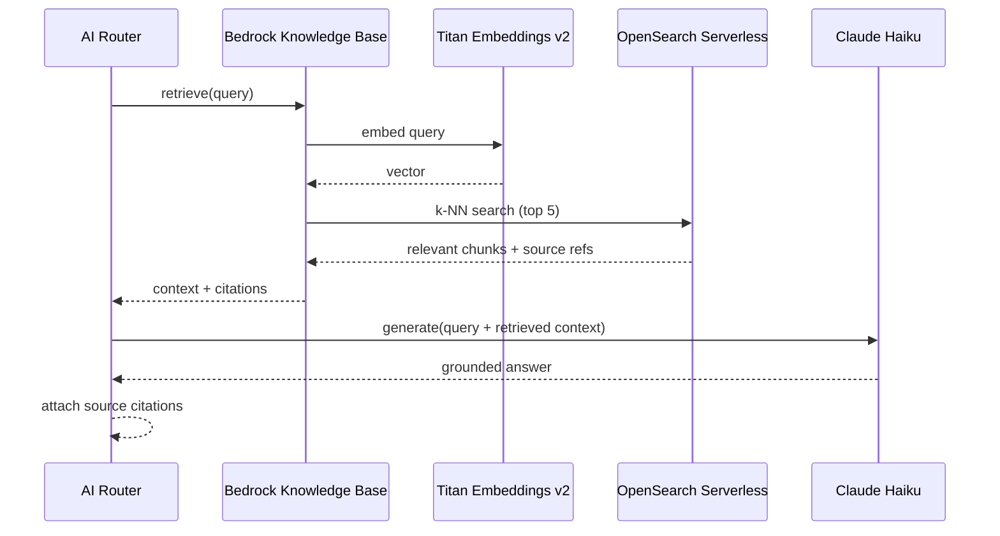
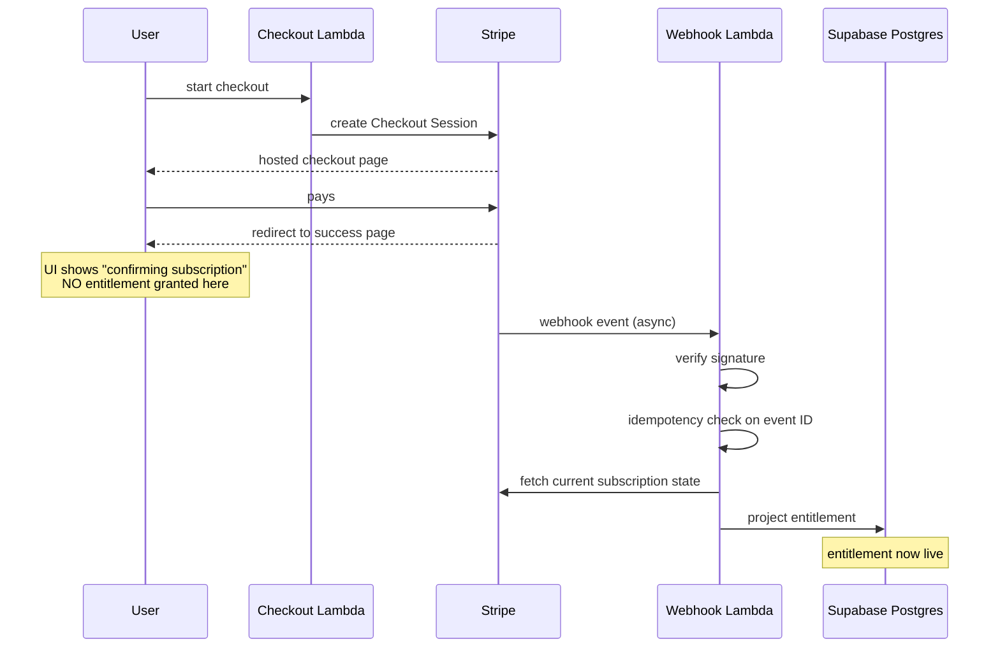
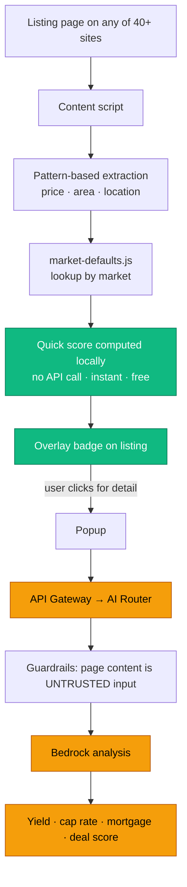
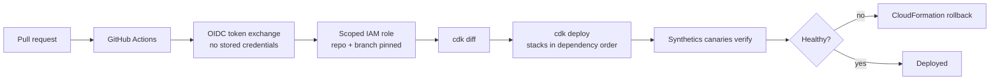

# Terrava — Architecture Deep Dive

The [root README](../README.md) shows *what* is deployed. This document covers *how it
behaves*: request lifecycles, where state lives, what happens when each dependency fails, and
where the design runs out of room.

The [decision records](decisions/) cover *why* each choice was made.

> **Current as of the July 2026 data-tier retirement.** The VPC, NAT Gateway, Aurora, RDS
> Proxy, and ElastiCache were removed once the system of record moved to Supabase — see
> [ADR-0017](decisions/0017-retire-vpc-aurora-elasticache.md). Documentation describing a
> three-tier VPC with Aurora behind RDS Proxy describes the *previous* architecture.

---

## Contents

- [System shape](#system-shape)
- [Request lifecycles](#request-lifecycles)
  - [An authenticated API request](#1-an-authenticated-api-request)
  - [An AI analysis request](#2-an-ai-analysis-request)
  - [A regulatory question (RAG)](#3-a-regulatory-question-rag)
  - [A subscription purchase](#4-a-subscription-purchase)
  - [A Chrome extension analysis](#5-a-chrome-extension-analysis)
- [Where state lives](#where-state-lives)
- [Failure modes](#failure-modes)
- [Scaling limits](#scaling-limits)
- [Environments and deployment](#environments-and-deployment)
- [Observability](#observability)
- [Known weaknesses](#known-weaknesses)

---

## System shape

Four layers, each with a distinct failure and cost profile.

Two ideas carry most of the weight:

**The AI tier is treated as a metered cost centre, not a dependency.** Routing, caching, and a
token ledger exist because inference cost is a unit-economics constraint that has to be
enforced at runtime (ADR-0005, ADR-0006).

**The network tier was removed once it stopped protecting anything.** With Supabase as the
system of record, every egress target is a public endpoint — so a VPC bought a NAT single
point of failure and no isolation (ADR-0017). The security boundary is API Gateway plus the
JWT authorizer, IAM least-privilege execution roles, WAF at CloudFront, and TLS everywhere —
none of which depend on a VPC.

---

## Request lifecycles

### 1. An authenticated API request

The baseline path — every other flow is this plus something.

Points worth noting:

- **The authorizer result is cached by API Gateway**, so most requests in a session skip that
  Lambda entirely. This is why the ~40 ms saving (ADR-0009) matters less per-request than it
  first appears, and why the authorizer cache TTL is a deliberate security trade — a
  revocation isn't effective until it expires.
- **Tier resolution happens once, at the edge.** Handlers receive tier in the authorizer
  context and never re-derive it. This is what keeps entitlement logic out of every handler.
- **There is no cache layer on this path today.** ElastiCache was removed with the rest of the
  VPC tier, and its read-caching and rate-limiting roles have not been replaced. This is the
  most significant open gap in the current architecture — see Known weaknesses.

### 2. An AI analysis request

The most expensive path in the system, and the one with the most machinery around it.

The ordering is deliberate:

1. **Cache before guardrails before inference.** A cache hit costs nothing and skips
   everything — but the cache key includes the prompt version, so a prompt change invalidates
   correctly (ADR-0016).
2. **Guardrails run on input *and* output.** Input checking catches prompt injection before it
   reaches the model; output checking catches non-compliant language the model produced anyway
   (ADR-0008).
3. **The token ledger write is not optional.** Every call produces a ledger entry and a
   CloudWatch metric. Cost visibility that's conditional isn't cost visibility.

This tier is unaffected by the VPC retirement — Bedrock and DynamoDB were always reached over
their public endpoints with IAM auth and TLS.

### 3. A regulatory question (RAG)

The cheap model is correct here, not a compromise: once the right source text is in context,
the task is comprehension and formatting rather than reasoning from memory. Retrieval quality,
not model capability, is the binding constraint on answer quality (ADR-0007).

### 4. A subscription purchase

The flow that most often gets built wrong.

**The success redirect grants nothing.** Entitlement is only ever written from a
signature-verified webhook, because the redirect can be missed, replayed, or forged, and it
tells you nothing about the renewal that fails three months later (ADR-0011).

The cost is a brief window where a paying user isn't yet entitled, which the UI has to handle
gracefully.

### 5. A Chrome extension analysis

Two tiers of work, deliberately split by cost.

The quick score runs entirely in the browser with no backend call, so the common path — a user
browsing listings — costs nothing to serve. Only the detailed analysis spends inference, which
ties AI cost to engaged users rather than page views (ADR-0014).

**This is the platform's highest-risk input path.** Third-party page content flows into a
model, so a listing site could embed instructions in page text. Guardrails' prompt-attack
detection is the primary control (ADR-0008), backed by least-privilege design so a successful
injection reaches nothing valuable.

---

## Where state lives

| Store | Holds | Access pattern | Why here |
|---|---|---|---|
| **Supabase Postgres** | Users, properties, portfolios, agent pipelines, subscriptions projection, community content | Joins, transactions, aggregates | The domain is relational. Managed Postgres removes the connection-pooling and capacity problems that Aurora + RDS Proxy existed to solve |
| **DynamoDB** | AI response cache, token ledger, prompt registry, sessions, high-throughput events | Key-value, TTL-bounded, durable, pay-per-request | Native TTL, single-digit-ms reads, cost tracks usage |
| **S3** | React SPA bundle, RAG source documents | Static objects | — |
| **OpenSearch Serverless** | Document embeddings (vectors) | k-NN similarity search | Vector search for the RAG pipeline |
| **Secrets Manager** | All credentials | Read at cold start, cached | Never in code or environment variables |

**No shared cache tier.** ElastiCache held the API response cache and the sliding-window
rate-limit counters and was removed with the VPC (ADR-0017). The rate-limiting problem it
solved has not gone away: Lambda has no shared memory between execution environments, so a
per-instance counter is meaningless — 200 concurrent Lambdas each counting to 3 admits 600
requests. Restoring per-tier quota enforcement requires a shared atomic counter, and the right
shape is a serverless cache with a public endpoint rather than a reintroduced VPC.

---

## Failure modes

| Failure | Blast radius | Behaviour | Mitigation |
|---|---|---|---|
| **Bedrock throttled or degraded** | AI features | Circuit breaker opens → Haiku, then Gemini Flash fallback. Cached responses unaffected | Multi-model routing, cross-provider fallback (ADR-0005) |
| **Supabase unavailable** | All relational reads/writes | Hard dependency — the system of record is a third-party SaaS | Vendor SLA and status monitoring; no in-house failover |
| **DynamoDB unavailable** | AI paths | Cache miss (degrades to full-price inference); prompt registry needs a bundled last-known-good fallback or AI features fail | Bundled fallback prompts (ADR-0016) |
| **OpenSearch unavailable** | Regulatory Q&A only | RAG answers fail; all other AI paths unaffected | Isolated to one feature |
| **Stripe webhook outage** | Entitlement freshness | Local projection goes stale; existing entitlements keep working | Periodic reconciliation against the Stripe API (ADR-0011) |
| **Traffic spike** | Rate-limited endpoints | **No shared counter today** — the limiter falls back to allow, so a spike reaches the AI tier and spends real money | Open gap. API Gateway per-route throttling and WAF rate rules are the only remaining controls |
| **Bad Lambda Layer deploy** | **Both products simultaneously** | This is the accepted cost of a shared platform | Staged rollout; the strongest argument for splitting (ADR-0013) |
| **Extraction breaks on a listing site** | That site's extension users | **Silent** — score is wrong or absent, nothing errors | Per-site synthetic monitoring (ADR-0014) |
| **Region-wide AWS outage** | Everything | No cross-region failover today | Accepted — see Known weaknesses |

**Historical note.** The NAT Gateway used to be a single point of failure on this list: when it
was removed during unrelated infrastructure work, every VPC-attached Lambda lost egress at once
and the AI features returned 500s. Removing the VPC removed that failure mode entirely
(ADR-0017) — one of the clearest cases where deleting infrastructure improved reliability.

---

## Scaling limits

| Constraint | Current headroom | What happens at the limit | Next move |
|---|---|---|---|
| **Supabase plan limits** | Per plan: connections, compute, storage | Connection saturation or throttling under Lambda concurrency | Supabase connection pooling (PgBouncer/Supavisor); scale the plan; reintroduce a cache to cut read volume |
| **Lambda account concurrency** | Regional default (raisable) | Throttling under a spike | Reserved concurrency on critical paths, request a raise |
| **Lambda 15-minute ceiling** | Per invocation | Long jobs can't run as one function | Already decomposed via EventBridge + SQS |
| **Bedrock throughput quotas** | Per-model, per-region | Throttling on AI paths | Circuit breaker + fallback already handles it; provisioned throughput if sustained |
| **No rate limiting** | — | Unbounded per-user AI spend | Restore a shared counter — the highest-priority gap |
| **DynamoDB hot partitions** | Per-partition limits | Throttling on a hot key | Cache keys are hashes, which distributes well by construction |
| **CloudFormation 500 resources/stack** | Split across stacks | Deploy failure | Split further |
| **OpenSearch OCU minimum** | ~$24/mo floor, not a throughput limit | Overpaying at low volume | Migrate to pgvector on the Postgres already running |

**At 10x current traffic, the database is the binding constraint** — but the shape of that
constraint changed with the move to Supabase. It is now a vendor capacity and connection-limit
question rather than an ACU ceiling and RDS Proxy pinning question. The first move is the same
as it always was: cut read volume with a cache, which is also what restores rate limiting.

---

## Environments and deployment

Properties this gives:

- **No static AWS credentials exist anywhere** (ADR-0015). Credentials are minted per workflow
  run and expire with it.
- **`cdk diff` before every prod deploy is mandatory.** CDK's abstractions can hide a resource
  replacement behind a one-line change — reading the diff is the control that catches a
  construct change about to replace a database. The VPC detachment in ADR-0017 is the model
  case: a diff showing 37 `[-] VpcConfig` removals, zero resources added, zero IAM changes, is
  what made a structural change safe to ship.
- **Stack dependency ordering is resolved by CDK**, not by a runbook.
- **Drift detection** answers "has anyone touched prod by hand?" — and caught the phantom
  `RETAIN` Aurora cluster that ADR-0017 cleaned up.

---

## Observability

Three questions the platform has to answer at 3am, and what answers each.

**Is it up?** CloudWatch Synthetics canaries every five minutes against both the API and the
frontend. These catch what internal metrics miss — a broken deploy that leaves Lambda healthy
and the site unusable shows as a canary failure, not a Lambda error.

**Why is it slow?** X-Ray distributed tracing across the request path, so a slow request
resolves to a specific segment — authorizer cold start, database query, Bedrock latency —
rather than a guess.

**What is it costing?** Every AI call writes `model`, `input_tokens`, `output_tokens`,
`latency`, `cache_hit`, and `user_tier` to a CloudWatch custom-metrics namespace and a
DynamoDB ledger. That gives cost per feature, cost per tier, and cache hit rate as live
dashboard metrics rather than an end-of-month surprise. AWS Budgets anomaly detection covers
the rest of the account.

| Metric | Why it's watched | What a change means |
|---|---|---|
| AI cache hit rate | Direct cost driver | A drop means prompts or context keys changed unintentionally |
| Cost per request by tier | Unit economics | Rising means routing is drifting toward expensive models |
| Guardrail block rate | Compliance + UX | Spike means either an attack or a false-positive regression |
| Canary success rate | Real availability | The only metric that reflects what users experience |
| DLQ depth | Async failure capture | Anything above zero is a job that didn't run |

---

## Known weaknesses

Stated plainly, because an architecture document that only lists strengths isn't an
architecture document.

**Rate limiting is not enforced.** ElastiCache held the shared counter and was removed with the
VPC tier. The limiter falls back to allow, which means per-tier AI quotas are currently
advisory. Given that AI calls cost real money per request, this is the highest-priority gap in
the system — it converts a cost control into an honour system.

**No read cache.** The same removal took out the API response cache, so read traffic goes
straight to the database. This raises both latency and vendor load.

**Single region.** No cross-region failover. A region-wide AWS outage is a full outage. A
deliberate cost trade, and the first thing to change if a customer requires an availability
SLA.

**The system of record is a third-party SaaS.** Supabase removed real operational burden, but
durability, backup, and availability now rest on a vendor relationship rather than
AWS-managed infrastructure. It also means the most sensitive traffic in the platform crosses
the public internet over TLS — which is exactly why the VPC could not deliver the guarantee it
appeared to (ADR-0017).

**No fixed egress IP.** Outbound calls originate from AWS's shared pool. Fine today, since no
upstream IP-allowlists us — but a future bank or government API that requires one needs a
dedicated egress path built for it.

**Shared-platform blast radius.** A bad Lambda Layer deploy can take down both products at
once (ADR-0013). Separate platforms would contain it at roughly double the cost.

**The custom authorizer is owned security code.** ES256 verification, key rotation, and
algorithm-confusion defense are the platform's responsibility, not a vendor's (ADR-0009). A
subtle bug is an auth bypass. It is the highest-consequence custom code in the system.

**Silent extension degradation.** When a listing site redesigns, extraction produces a wrong or
missing score with no error anywhere (ADR-0014). Detecting it needs per-site synthetic
monitoring.

**Cache staleness on AI responses.** Up to 24 hours (ADR-0006). Managed by keeping live-priced
paths uncached, but it has to be reasoned about per feature.

**OpenSearch Serverless is the weakest line in the cost model.** A ~$24/month OCU floor for a
low-volume feature (ADR-0007). pgvector on the existing Postgres is the obvious replacement.

**The deploy role is over-permissioned.** OIDC removed credential leakage but not
over-permission (ADR-0015). Per-stack-group roles are the natural next step.

**Prompts bypass code review.** The registry makes iteration fast and compliance fixes
immediate, at the cost of letting a change reach production without a PR (ADR-0016).
